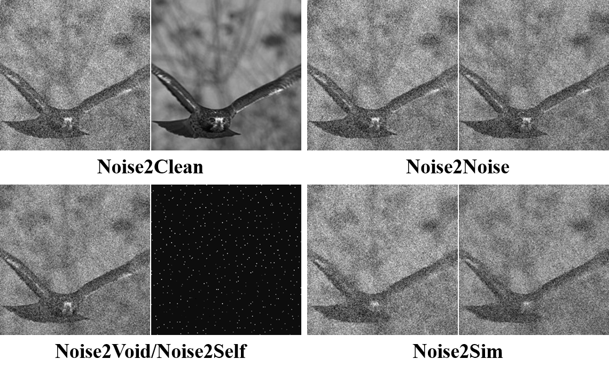

# Suppression of Independent and Correlated Noise with Similarity-based Unsupervised Deep Learning
Under review. (**In Updating**)

[comment]: <> (<tr>)

[comment]: <> (<td></td>)

[comment]: <> (</tr>)

## Introduction
This is a general similarity-based unsupervised deep denoising approach to suppress not only independent but also correlated image noise.
Theoretical analysis proves the equivalent effectiveness of this unsupervised approach to the supervised counterpart.
This project shows several application cases, including denoising natural, microscopic, low-dose CT and photon-counting micro-CT images.
This general approach can be applied to many other fields by constructing the similar training samples based on the domain-specific prior.


## Installation
Assuming [Anaconda](https://www.anaconda.com/) with python 3.6, the required packages for this project can be installed as:
```shell script
conda install pytorch==1.7.1 torchvision==0.8.2 torchaudio==0.7.2 cudatoolkit=11.0 -c pytorch  # install pytorch
conda install -c pytorch faiss-gpu  # install faiss-gpu
conda install -c conda-forge python-lmdb tqdm imageio addict opencv matplotlib pydicom scipy
pip install mat73
```
Then, clone this repo
```shell script
git clone https://github.com/niuchuangnn/noise2sim.git
cd noise2sim
```

## Applications

### Natural Images

Download BSD68 test dataset at [here](https://drive.google.com/drive/folders/1b_RvBwIr9yLg8yPWb0BHYmWiOEVUvG4K?usp=sharing),
and put them under the folder  ```./datasets/```

[comment]: <> (```shell script)

[comment]: <> (python ./tools/download_bsd68_noise2void.py)

[comment]: <> (```)

Prepare dataset:
```shell script
python ./tools/prepare_bsd400_lmdb.py
```

Run on 1 GPU:
```shell script
python ./tools/train_dist.py --config-file ./configs/bsd400_unet2_ps3_ns8_gpu1.py
```
Run on 8 GPUs:
```shell script
python ./tools/train_dist.py --config-file ./configs/bsd400_unet2_ps3_ns8_gpu8.py
```
The results in the paper were obtained using 8 GPUs, you can obtain similar results with 1 GPU.

### Low-dose CT Images
The low-dose CT dataset can be obtained at [Low Dose CT Grand Challenge](https://www.aapm.org/grandchallenge/lowdosect/).

Arrange the Mayo data like:

    ├── datasets   
        ├── Mayo                   
            ├── L067                    
            ├── L096
            ...

Run on 4 GPUs:

Prepare train and test data files:

```shell
python tools/prepare_mayo.py --patient-folder L067 L096 L109 L143 L192 L286 L291 L310 --output-file ./datasets/Mayo/mayo_train.txt
python tools/prepare_mayo.py --patient-folder L506 L333 --output-file ./datasets/Mayo/mayo_test.txt
```
Run on 4 GPUs:
```shell
python ./tools/train_dist.py --config-file ./configs/mayo_unet2.py
```

### Spectral CT Images
The photon-counting spectral micro-CT data can be obtained [here](https://drive.google.com/file/d/1UaS6YdPZ_M0opxpIaUXjbydNq1IlVDiG/view?usp=sharing),
and put it under ```./datasets/```.

Run on 4 GPUs:
```shell
python ./tools/train_dist.py --config-file ./configs/sct_unet2.py
```

### Microscopy Images
The microscopy image can be obtained [here](http://data.celltrackingchallenge.net/challenge-datasets/Fluo-N2DL-HeLa.zip).


## Citation

```shell
@inproceedings{noise2sim2021,
  title={Noise2Sim – Similarity-based Self-Learning for Image Denoising},
  author={Niu, Chuang and Wang, Ge},
  booktitle={arXiv:2011.03384},
  year={2020}
}
```
